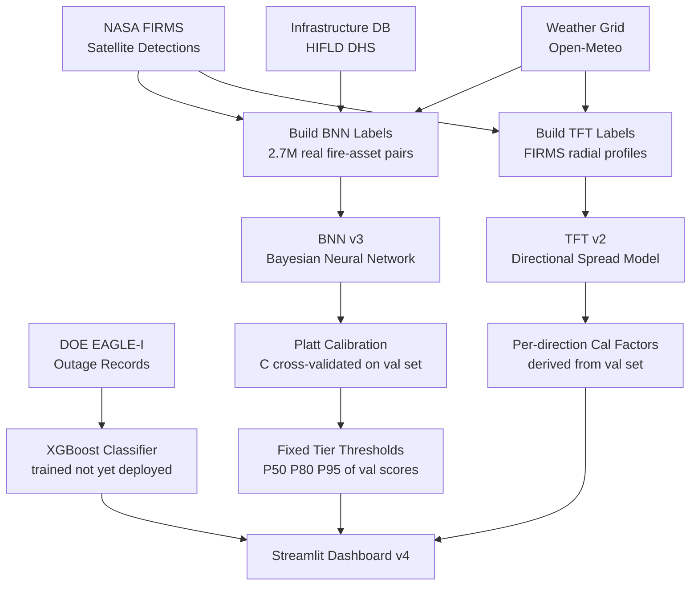

# Prometheus-AI

> AI-powered wildfire spread forecasting and infrastructure risk intelligence.

---

## What This Is

Prometheus-AI answers two questions during an active wildfire:

1. **Right now** — which infrastructure assets are at risk from this fire?
2. **In 6, 12, and 24 hours** — where will this fire be, and which assets will it threaten by then?

Built entirely on publicly available satellite and weather data. Every model is trained on real observed fire events — no synthetic labels, no manually chosen multipliers.

---

## Architecture



---

## The Three Models

<details>
<summary><b>Model 1: BNN v3 — Current Risk Scoring</b></summary>

### What it does

Scores every infrastructure asset in the viewport with a risk score (0–100, relative to current viewport) and a calibrated probability of fire reaching that asset. High uncertainty means the model is unsure — treat those assets with extra caution.

### How the labels were built

This is the most important part. **Labels are real.** For every infrastructure asset on every day from 2017–2024, I asked: *did NASA FIRMS satellite detections record fire within 5km of this asset in the next 24 hours?* That binary answer (yes/no) is the training label. No synthetic formulas, no proxies.

- 2.7 million samples total
- 0.3% positive rate (fire actually reached infrastructure) — reflects reality
- Train: 2017–2021 | Val: 2022–2023 | Test: 2024 (never touched during training)

### How it works

A 4-layer neural network (256 → 128 → 64 → 32 → 1) with MC Dropout (Bayesian approximation). The model runs 50 times with random neurons dropped each pass. The mean of those 50 outputs is the raw risk score. The standard deviation is the uncertainty.

### Features (11 total)

| Feature | Why it matters |
| :--- | :--- |
| Distance to nearest fire (km) | Most important — confirmed by permutation importance test |
| Mean distance to all fires within 50km | Cluster size context |
| Number of fires within 30km | Cluster density |
| Fire Radiative Power (FRP) | Satellite-measured fire intensity |
| Wind speed (km/h) | Drives spread rate |
| Wind direction (°) | Determines which assets are downwind |
| Temperature (°C) | Affects fire behavior |
| Humidity (%) | Dry conditions = faster spread |
| Wind-fire alignment | How directly wind blows toward each asset |
| Drought index | Fuel moisture proxy |
| Days since last rain | Accumulated dryness |

### Calibration

Raw MC Dropout outputs are not well-calibrated due to extreme class imbalance (0.3% positive rate). I apply **Platt scaling** (logistic regression) to map raw outputs to calibrated probabilities.

- C parameter: chosen by 5-fold cross-validation on val set (best C = 10, not sklearn default)
- Tier thresholds (CRITICAL / HIGH / MEDIUM / LOW): derived from P50 / P80 / P95 of the val set calibrated score distribution — never recomputed per batch or hardcoded

### Validation results

| Split | AUC | Brier Score | Brier Skill |
| :--- | :--- | :--- | :--- |
| Val (2022–2023) | 0.74 | 0.00181 | +0.0048 |
| Test (2024 holdout) | **0.78** | 0.00246 | +0.0123 |

Test AUC higher than val — generalizes well to unseen 2024 fires.
Feature importance #1: min_dist_km. Physically expected — confirmed by data.

### Important honest limitation

Calibrated probabilities max out around 2.7% even for assets in an active fire zone. This is **mathematically correct** for a 0.3% base rate model. It does not mean the model is broken. It means: in 8 years of training data, fire reaching infrastructure happened 3 times per 1000 asset-days. The model correctly reflects that rarity. For operational triage, I display a 0–100 relative risk score (viewport-normalized) alongside the calibrated probability.

</details>

---

<details>
<summary><b>Model 2: TFT v2 — Directional Spread Forecast</b></summary>

### What it does

Predicts how the fire perimeter will expand in 8 compass directions (N, NE, E, SE, S, SW, W, NW) at T+6h, T+12h, and T+24h. Outputs P10 / P50 / P90 quantiles per direction, giving an uncertainty-aware asymmetric forecast. The result is a directional polygon — not a circle — that elongates downwind.

### How the labels were built

For every day a fire was active (from NASA FIRMS), I:

1. Took the satellite fire detections on day T and computed a **radial profile** — the distance from the fire's center to its edge in each of 8 compass directions
2. Did the same for day T+1
3. The label for each direction = (radius at T+1) − (radius at T) in km

This gives 8 real measured expansion values per training sample, one per direction.

- 2,535 matched consecutive-day fire pairs
- Train: 2017–2021 | Val: 2022–2023 | Test: 2024 (holdout)

### Architecture

Shared encoder (Dense 64 → 32 → 16) + 8 directional output heads × 3 quantiles (P10/P50/P90) = 24 total outputs. Loss: pinball (quantile) loss — the correct loss function for predicting distributions, not just means.

### Calibration

Per-direction calibration factors computed from the val set: median(actual expansion / predicted P50) per direction. Correct for systematic bias in each compass direction. Not manually chosen — derived from 2022–2023 validation fires.

### Validation results

| Split | MAE (km) | P10–P90 Coverage |
| :--- | :--- | :--- |
| Val (2022–2023) | 2.49 km | 78.9% |
| Test (2024 holdout) | **2.77 km** | 79.7% |

P10–P90 coverage target is 80%. I hit 79–80%. This means when I say "the fire will expand between X and Y km in this direction," that range contains the actual outcome about 80% of the time. Correctly calibrated uncertainty.

### How it shows up on the dashboard

- Solid polygon = P50 predicted perimeter at the selected horizon
- Dashed polygon = P90 conservative bound (1.3× the P50 expansion)
- Polygon is asymmetric — stretches further in the downwind direction
- Area and max-spread metrics increase across T+6h → T+12h → T+24h

### Known limitation

The TFT was trained on daily (24h) FIRMS data. Sub-24h horizons (T+6h, T+12h) are computed by linear interpolation of the T+24h prediction. Fire spread is not perfectly linear — this is a documented approximation.

</details>

---

<details>
<summary><b>Model 3: XGBoost — Real-Label Risk Classifier (trained, not yet deployed)</b></summary>

### What it does

A binary classifier predicting the probability of a power outage at a location given fire proximity, weather, and asset type. Trained on real historical outage data from the DOE EAGLE-I database — actual recorded customer outages during active fires.

### Why this matters

The BNN labels ask: *did fire come near this asset?*
The XGBoost labels ask: *did this asset actually lose power?*

These are different questions. An asset can be near a fire and not lose power. XGBoost captures realized impact, not just proximity. AUC 0.973 on real outage data is strong.

### Labels

- Positive (1): location had more than 2% of customers without power during an active fire within 50km
- Negative (0): active fire within 50km but no significant outage recorded
- 306,000 samples, balanced 50/50, per-year quota 2017–2025

### Results

| Metric | Value |
| :--- | :--- |
| ROC-AUC | 0.973 |
| Average Precision | 0.974 |
| Accuracy | 91% |
| Optimal threshold | 0.321 |

### Why not deployed in v4

EAGLE-I reports outages at county level, not asset level. Deploying it would mean assigning county-level risk to individual assets — too coarse. Fix requires PSPS event filtering and tighter spatial joins with asset locations.

### Why it is worth mentioning

When properly deployed at asset level, it adds a second signal: not just "is fire nearby?" but "given fire nearby, does this type of asset in this region historically lose power?" Proximity model + impact model combined is more powerful than either alone.

</details>

---

## Inference Pipeline

This is the bridge that connects TFT and BNN at each forecast horizon:

```
NASA FIRMS detections
        ↓
DBSCAN clustering → identify distinct fires
        ↓
Radial profile → current fire shape in 8 directions
        ↓
TFT v2 → predicted expansion per direction at T+6h/12h/24h
        ↓
Reconstruct projected perimeter polygon
        ↓
Compute distance: each infrastructure asset → projected perimeter
        ↓
Open-Meteo API → actual hourly weather forecast at fire centroid
        ↓
BNN v3 + Platt calibration → risk score per asset
        ↓
Fixed val-set thresholds → CRITICAL / HIGH / MEDIUM / LOW
```

At T+0h: BNN uses distance to nearest actual FIRMS detection point.
At T+6h/12h/24h: BNN uses distance to TFT-projected perimeter + actual forecast weather.

---

## Integration Test — Camp Fire 2018-11-08

Before shipping, I validated on the most destructive wildfire in California history.

**Setup:** Load the 580 real FIRMS satellite detections from November 8, 2018. Score test assets at known locations around the fire. Check three things:

1. Feather River Hospital (Paradise, CA — actual coordinates 39.769, -121.618) scores CRITICAL ✅
2. Assets downwind (SW of fire, wind from NE at 72 km/h) score higher than assets upwind (NE) ✅
3. Risk decreases as distance from fire increases ✅

All three pass. Plots in `validation/bridge/`.

---

## Dashboard

Built with Streamlit and Folium.

| Tab | What you see |
| :--- | :--- |
| Current Risk | BNN v3 scored assets. Score = 0–100 relative rank in viewport. Color = tier from fixed Platt thresholds. |
| T+6H Forecast | TFT v2 directional perimeter polygon at +6h. BNN re-scores with +6h forecast weather. |
| T+12H Forecast | Wider polygon. Assets that were MEDIUM may now be CRITICAL. |
| T+24H Forecast | Widest polygon. Full 24h projection with P90 conservative bound. |
| Validation | All proof plots inline: ROC curve, calibration, feature importance, TFT coverage, Camp Fire test. |

The validation tab directly addresses reviewer concerns — every metric, every plot, every known limitation is visible inside the app.

---

## Data Sources

| Dataset | Source | Coverage |
| :--- | :--- | :--- |
| Fire detections | NASA FIRMS VIIRS (high-confidence only) | 146,574 detections 2017–2025, western US |
| Infrastructure | HIFLD DHS | 64,459 assets — substations, plants, hospitals, schools, fire stations |
| Weather historical | Open-Meteo archive API | Hourly grid, 2017–2025 |
| Weather forecast | Open-Meteo forecast API | Hourly T+0 to T+24h, live at runtime |
| Power outages | DOE EAGLE-I | 24.9M records 2017–2025 (XGBoost only) |
| County customers | EIA MCC | 3,234 counties (XGBoost only) |

Note: NIFC fire perimeters were evaluated and removed. The public API returns only the most recent perimeter per fire — no historical daily snapshots available. FIRMS detections are used instead for both BNN and TFT training labels.

---

## Project Structure

```
Prometheus-AI/
│
├── src/
│   ├── pipeline/
│   │   ├── build_bnn_labels.py         Builds 2.7M real FIRMS-based training samples
│   │   ├── train_bnn_v3.py             Trains BNN v3 with MC Dropout
│   │   ├── calibrate_bnn_v3.py         Platt scaling, C cross-validated, fixed thresholds
│   │   ├── build_tft_v2_dataset.py     Builds radial profile labels from FIRMS clusters
│   │   ├── train_tft_v2.py             Trains 8-head quantile regressor
│   │   ├── inference_bridge.py         TFT → perimeter → BNN pipeline + Camp Fire test
│   │   ├── weather_forecast.py         Open-Meteo hourly forecasts
│   │   └── train_xgboost_risk.py       XGBoost on EAGLE-I outage labels (not deployed)
│   │
│   └── app/
│       └── streamlit_app_v4.py         Dashboard
│
├── models/
│   ├── bnn_v3_best.keras               Trained BNN v3 weights
│   ├── bnn_v3_scaler.pkl               StandardScaler for BNN features
│   ├── bnn_v3_calibrator.pkl           Platt scaler (LogisticRegression C=10)
│   ├── bnn_v3_thresholds.json          Fixed CRITICAL/HIGH/MEDIUM/LOW boundaries
│   ├── bnn_v3_metadata.json
│   ├── tft_v2_best.keras               Trained TFT v2 weights
│   ├── tft_v2_scaler.pkl               StandardScaler for TFT features
│   ├── tft_v2_calibration_factor.json  Per-direction calibration from val set
│   ├── tft_v2_metadata.json
│   ├── xgboost_risk.json               XGBoost model (trained, not deployed)
│   ├── xgboost_calibrator.pkl
│   └── xgboost_asset_encoder.pkl
│
├── validation/
│   ├── bnn/                            ROC, calibration, feature importance plots + JSONs
│   ├── tft/                            Predicted vs actual, coverage, loss curves + JSONs
│   └── bridge/                         Camp Fire integration test plots + JSON
│
├── data/                               Not committed — see Data Sources
├── .gitignore
├── requirements.txt
└── README.md
```

---

## Setup

```bash
git clone https://github.com/Parthav-N/Prometheus-AI.git
cd Prometheus-AI

python -m venv venv
venv\Scripts\activate           # Windows
source venv/bin/activate        # Mac/Linux

pip install -r requirements.txt
```

Run the dashboard:

```bash
streamlit run src/app/streamlit_app_v4.py
```

Retrain from scratch (run in this order):

```bash
python src/pipeline/build_bnn_labels.py
python src/pipeline/train_bnn_v3.py
python src/pipeline/calibrate_bnn_v3.py
python src/pipeline/build_tft_v2_dataset.py
python src/pipeline/train_tft_v2.py
python src/pipeline/inference_bridge.py
```

---

## Known Limitations

| Limitation | What it means | Status |
| :--- | :--- | :--- |
| Score compression | Calibrated probabilities max at ~2.7% for assets near fire | Expected — 0.3% base rate. Model ranks correctly, absolute probability is small by design |
| Sub-24h TFT horizons | T+6h/T+12h use linear interpolation of T+24h prediction | Documented — FIRMS is daily resolution, no sub-daily training data |
| Upwind assets at <15km score CRITICAL | Distance dominates wind alignment in BNN | Operationally conservative — spot fires and embers can reach upwind assets |
| TFT convex hull approximation | Real perimeters follow terrain, not convex hulls | Accurate for large fires, coarser for small/sparse satellite coverage |
| XGBoost not deployed | EAGLE-I is county-level, not asset-level | Fix requires PSPS filtering and tighter spatial join |
| Historical forecast weather | Past events reuse same weather at all horizons | No historical hourly forecast archive available |

---

## v5 Roadmap

| Item | What it addresses |
| :--- | :--- |
| Deploy XGBoost at asset level | Adds realized-impact signal alongside proximity signal |
| More FIRMS training data | Wider BNN score range — reduces compression |
| Sub-daily TFT | Train on hourly satellite passes instead of daily aggregates |
| National coverage | Extend beyond western US |
| Terrain and fuel layers | Add slope and vegetation type as BNN features |
| NIFC live perimeter | Use official current perimeter at inference time |

---

## Tech Stack

| Category | Tools |
| :--- | :--- |
| Deep Learning | TensorFlow / Keras (BNN v3, TFT v2) |
| ML | XGBoost, scikit-learn, joblib |
| Calibration | Platt scaling (LogisticRegression), pinball (quantile) loss |
| Data | Pandas, NumPy, SciPy |
| Geospatial | Folium, Shapely, DBSCAN (scikit-learn) |
| Dashboard | Streamlit, streamlit-folium |
| APIs | NASA FIRMS, Open-Meteo |

---
