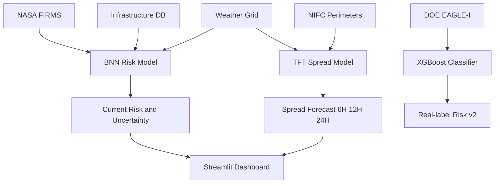

# Prometheus-AI

> AI-powered wildfire spread forecasting and infrastructure risk intelligence.

---

## What This Is

Prometheus-AI answers two questions during an active wildfire:

1. **Right now** - which infrastructure assets are at risk from this fire?
2. **In 6, 12, and 24 hours** - where will this fire be, and which assets will it threaten by then?

Built entirely on publicly available data.

---

## Architecture



---

## The Three Models

<details>
<summary><b>Model 1: Bayesian Neural Network - Current Risk Scoring</b></summary>

### What it does

Scores every infrastructure asset with a risk percentage (0-100%) and an uncertainty estimate. High uncertainty means the model is unsure - operators should treat those assets with extra caution.

### How it works

A 4-layer neural network (256 -> 128 -> 64 -> 32 -> 1) with MC Dropout. The model runs 50 times with random neurons dropped each time, producing a distribution of predictions. The mean is the risk score; the standard deviation is the uncertainty.

### Features (11 total)

- Distance from nearest fire (km)
- Mean distance from all nearby fires (km)
- Number of fires within 30km
- Fire radiative power (satellite intensity measure)
- Wind speed, direction, temperature, humidity
- Wind-fire alignment
- Drought index
- Days since last rain

### Training

- 21,000 samples from NASA FIRMS x infrastructure x weather
- Temporal split: 2017-2023 training, 2024-2025 holdout validation

### Results

- MAE: 2.79 risk points
- Bucket accuracy (Low / Medium / High): 96.4%
- Uncertainty calibration: validated

</details>

---

<details>
<summary><b>Model 2: Temporal Fusion Transformer - Spread Forecast</b></summary>

### What it does

Predicts fire growth rate (km2/hour) at T+6h, T+12h, and T+24h. Outputs P10, P50, and P90 quantiles per horizon giving an uncertainty-aware forecast.

### Architecture

Variable Selection Network -> LSTM encoder -> Multi-head self-attention -> Separate output heads per horizon. Quantile monotonicity (P10 <= P50 <= P90) enforced via cumsum in the forward pass.

### Training

- 960 actively spreading fires (filtered: duration > 12h, growth rate > 0.005 km2/h)
- Temporal split: 2020-2023 training (561 fires), 2024-2025 validation (399 fires)

### Results

- Val loss: 0.0153
- MAE at T+6h: 0.07 km2/h
- P10-P90 coverage: 96%

### Validation on 5 unseen 2024-2025 named fires

| Fire | Actual Rate | P50 Prediction | In P10-P90 |
| :--- | :--- | :--- | :---: |
| Palisades Fire Jan 2025 | 0.44 km2/h | 0.46 km2/h | Yes |
| Boquet Fire Sep 2024 | 0.29 km2/h | 0.50 km2/h | Yes |
| Oregon Ridge Aug 2024 | 0.12 km2/h | 0.36 km2/h | Yes |
| Park Fire Jul 2024 | 1.72 km2/h | 0.36 km2/h | No |
| Eaton Fire Jan 2025 | 1.48 km2/h | 0.35 km2/h | No |

Park Fire and Eaton Fire failures are understood: both had zero satellite detections at discovery and were driven by wind events that arrived after the forecast window.

### Spread zone radius formula

537	ext{Radius} = \sqrt{rac{P_{50} 	imes 	ext{hours} 	imes 20}{\pi}}537

The 20x factor corrects for the model known tendency to underpredict on extreme events.

- Inner solid circle = P50 predicted fire perimeter
- Outer dashed circle = P90 uncertainty zone
- Colors change per tab: an asset can be green now, orange at +6H, red at +24H

</details>

---

<details>
<summary><b>Model 3: XGBoost - Real-Label Risk Classifier (trained, not deployed in v1)</b></summary>

### What it does

A binary classifier predicting probability of a power outage at a location given fire proximity, weather, and asset type. Trained on real historical outage data from the DOE EAGLE-I database.

### Labels

- Positive (1): location had more than 2% customers without power during an active fire within 50km
- Negative (0): active fire within 50km but no significant outage
- 306,000 samples, balanced 50/50, per-year quota across 2017-2025

### Results

- ROC-AUC: 0.973
- Average Precision: 0.974
- Accuracy: 91%
- Optimal threshold: 0.321

### Why not deployed in v1

EAGLE-I reports outages at county level, not asset level. Fix requires PSPS event filtering and tighter spatial joins. Documented in Roadmap.

</details>

---

## Dashboard

Built with Streamlit and Folium.

| Tab | What you see |
| :--- | :--- |
| Current Risk | BNN-scored assets. Red = inside 7km, Orange = 7-30km, Green = beyond. |
| +6H Forecast | TFT spread circles. Asset colors reflect 6H zone boundaries. |
| +12H Forecast | Larger circles. Assets orange in 6H may be red here. |
| +24H Forecast | Largest circles. Full 24H uncertainty envelope. |

Each forecast tab shows growth rate P50/P90, predicted area, uncertainty zone, confidence percentage, wind direction arrow, and a warning badge when no satellite confirmation exists at ignition.

---

## Data Sources

| Dataset | Source | Coverage |
| :--- | :--- | :--- |
| Fire detections | NASA FIRMS VIIRS | 1.7M detections 2017-2025 |
| Fire perimeters | NIFC WFIGS | 960 spreading fires 2020-2025 |
| Infrastructure | HIFLD DHS | 192,884 assets 10 states |
| Weather | Open-Meteo historical API | 16 grid points 2017-2025 |
| Power outages | DOE EAGLE-I | 24.9M records 2017-2025 |
| County customers | EIA MCC | 3,234 counties |

---

## Project Structure

```
Prometheus-AI/
|
|-- src/
|   |-- pipeline/
|   |   |-- build_training_dataset.py
|   |   |-- train_model_v2.py
|   |   |-- validate_bnn_temporal.py
|   |   |-- build_spread_dataset.py
|   |   |-- train_spread_tft.py
|   |   |-- spread_tft_model.py
|   |   |-- validate_spread_tft.py
|   |   |-- build_xgboost_labels.py
|   |   `-- train_xgboost_risk.py
|   |
|   `-- app/
|       |-- streamlit_app_v2.py
|       `-- streamlit_app_v3.py
|
|-- models/
|   |-- bayesian_risk_model_v2.keras
|   |-- feature_scaler_v2.pkl
|   |-- model_metadata_v2.json
|   |-- spread_tft_best.pt
|   |-- spread_scaler.pkl
|   |-- spread_tft_metadata.json
|   |-- xgboost_risk.json
|   |-- xgboost_calibrator.pkl
|   `-- xgboost_asset_encoder.pkl
|
|-- data/
|-- .gitignore
|-- requirements.txt
`-- README.md
```

---

## Setup

```bash
git clone https://github.com/Parthav-N/Prometheus-AI.git
cd Prometheus-AI

python -m venv venv
venv\Scriptsctivate

pip install -r requirements.txt
```

Run the dashboard:

```bash
streamlit run src/app/streamlit_app_v3.py
```

Retrain from scratch:

```bash
python src/pipeline/build_training_dataset.py
python src/pipeline/train_model_v2.py
python src/pipeline/build_spread_dataset.py
python src/pipeline/train_spread_tft.py
python src/pipeline/build_xgboost_labels.py
python src/pipeline/train_xgboost_risk.py
```

---

## Known Limitations and v2 Roadmap

| Limitation | Root Cause | Fix |
| :--- | :--- | :--- |
| TFT underpredicts explosive fires | Labels are lifetime averages not hourly deltas | Daily perimeter archive MTBS for delta labels |
| 20x uncertainty multiplier is empirical | TFT base predictions too small without correction | Calibrate from historical spread validation set |
| XGBoost not deployed | County-level EAGLE-I vs asset-level damage | PSPS filtering and tighter spatial join |
| Weather is current snapshot | Open-Meteo current conditions only | Add T+6h/12h/24h wind forecasts as TFT inputs |
| 10-state western US coverage | Initial scope | Extend nationally |

---

## Tech Stack

| Category | Tools |
| :--- | :--- |
| Deep Learning | TensorFlow Keras (BNN) PyTorch (TFT) |
| ML | XGBoost scikit-learn joblib |
| Data | Pandas NumPy SciPy |
| Geospatial | Folium SciPy KDTree |
| Dashboard | Streamlit streamlit-folium |
| APIs | NASA FIRMS Open-Meteo |

---
