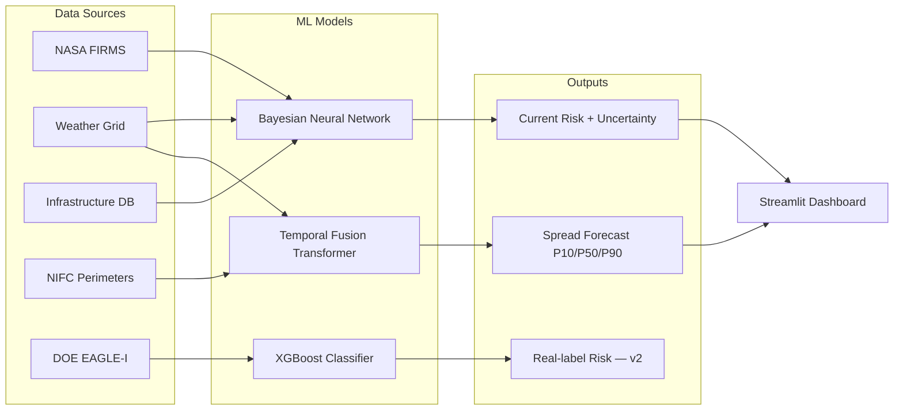

# 🔥 Prometheus-AI

> AI-powered wildfire spread forecasting and infrastructure risk intelligence.

---

## What This Is

Prometheus-AI answers two questions operators care about during an active wildfire:

1. **Right now** — which infrastructure assets are at risk from this fire?
2. **In 6, 12, and 24 hours** — where will this fire be, and which assets will it threaten by then?

Built entirely on publicly available data. Designed to work with any infrastructure dataset and scale to real operational environments.

---

## Architecture



---

## The Three Models

<details>
<summary><b>🧠 Model 1: Bayesian Neural Network (BNN) — Current Risk Scoring</b></summary>

### What it does
Scores every infrastructure asset in the map view with a risk percentage (0–100%) and an uncertainty estimate. High uncertainty means the situation is ambiguous — operators should treat those assets with extra caution regardless of the raw score.

### How it works
A 4-layer neural network (256 → 128 → 64 → 32 → 1) with MC Dropout. Instead of running once and giving a single number, the model runs 50 times with random neurons dropped each time — producing a distribution of predictions. The mean is the risk score; the standard deviation is the uncertainty.

This approximates Bayesian inference — the model doesn't just predict, it tells you how confident it is.

### Features (11 total)
- Distance from nearest fire (km)
- Mean distance from all nearby fires (km)
- Number of fires within 30km
- Fire radiative power (satellite intensity measure)
- Wind speed, direction, temperature, humidity
- Wind-fire alignment (is wind pushing fire toward this asset?)
- Drought index
- Days since last rain

### Training
- 21,000 samples built from NASA FIRMS × infrastructure × weather
- Temporal split: 2017–2023 training, 2024–2025 holdout validation
- The model never saw validation data during training

### Results
- MAE: **2.79 risk points**
- Bucket accuracy (Low / Medium / High): **96.4%**
- Uncertainty calibration: ✅ High uncertainty correlates with higher actual error

</details>

---

<details>
<summary><b>⚡ Model 2: Temporal Fusion Transformer (TFT) — Spread Forecast</b></summary>

### What it does
Predicts fire growth rate (km²/hour) at T+6h, T+12h, and T+24h. Outputs three quantiles per horizon — P10 (optimistic), P50 (median), P90 (worst case) — giving an uncertainty-aware forecast rather than a single guess.

### Why a Transformer
Fire spread is driven by multiple interacting variables — wind, temperature, humidity, terrain slope, fuel type, fire intensity — with different relevance at different time horizons. The TFT's Variable Selection Network learns which features matter most at each horizon. Quantile outputs make uncertainty visible and operational rather than hiding it behind a point estimate.

### Architecture
Variable Selection Network → LSTM encoder → Multi-head self-attention → Separate output heads per horizon.
Quantile monotonicity (P10 ≤ P50 ≤ P90) enforced via cumsum in the forward pass — guaranteed by construction.

### Training
- 960 actively spreading fires (filtered: duration > 12h, growth rate > 0.005 km²/h)
- Temporal split: 2020–2023 training (561 fires), 2024–2025 validation (399 fires)
- Log-transform on targets to handle right-skewed growth rate distribution
- Oversampling of fast-spreading fires (>0.5 km²/h) to correct regime imbalance

### Results
- Val loss: **0.0153**
- MAE at T+6h: **0.07 km²/h**
- P10–P90 coverage: **96%** (target: 80%)

### Validation on 5 unseen 2024–2025 named fires

| Fire | Actual Rate | P50 Prediction | In P10–P90? |
| :--- | :--- | :--- | :---: |
| Palisades Fire (Jan 2025) | 0.44 km²/h | 0.46 km²/h | ✅ |
| Boquet Fire (Sep 2024) | 0.29 km²/h | 0.50 km²/h | ✅ |
| Oregon Ridge (Aug 2024) | 0.12 km²/h | 0.36 km²/h | ✅ |
| Park Fire (Jul 2024) | 1.72 km²/h | 0.36 km²/h | ❌ |
| Eaton Fire (Jan 2025) | 1.48 km²/h | 0.35 km²/h | ❌ |

**Park Fire and Eaton Fire failures are understood:**
Both had zero satellite detections at discovery — no fire intensity signal available, only weather conditions. Both were also driven by wind events that arrived hours after the forecast window, invisible to a snapshot-based model. These are not random failures — they represent a specific, documented limitation with a clear fix path (see Roadmap).

### How spread zones appear on the dashboard
- Radius at each horizon: `√(P50 × hours × 20 / π)`
  - The 20× factor corrects for the model's known tendency to underpredict on extreme events
- **Inner solid circle** = P50 predicted fire perimeter
- **Outer dashed circle** = P90 uncertainty zone — plan for this
- **Colors change per tab:** an asset can be 🟢 green now, 🟠 orange at +6H, 🔴 red at +24H as the fire envelope expands

</details>

---

<details>
<summary><b>📊 Model 3: XGBoost — Real-Label Risk Classifier (trained, not deployed in v1)</b></summary>

### What it does
A binary classifier predicting the probability of a power outage at a location given fire proximity, weather conditions, and asset type. Unlike the BNN which uses formula-based risk scores, XGBoost was trained on real historical outage data.

### Labels from DOE EAGLE-I
- **Positive (1):** Location had >2% customers without power during an active fire within 50km
- **Negative (0):** Active fire within 50km but no significant outage occurred
- 306,000 samples — balanced 50/50, per-year quota ensures full 2017–2025 temporal coverage

### Features
Physical geographic features only — latitude, longitude, elevation proxy, distance from coast, wind alignment, fire intensity, weather. No state encoding — avoids teaching geography instead of physics.

### Results
- ROC-AUC: **0.973**
- Average Precision: **0.974**
- Accuracy: **91%**
- Optimal threshold: **0.321**
- Isotonic calibration applied for reliable probability outputs

### Why not deployed in v1
Known data quality issue: EAGLE-I reports outages at county level, not asset level. A county outage can be caused by a single transformer fault unrelated to any nearby fire. The model learned some county-level fire-season patterns alongside genuine physical signal. Fix requires PSPS event filtering and tighter spatial joins. Documented in Roadmap.

</details>

---

## Dashboard

Built with Streamlit and Folium.

**Base map:**
- OpenStreetMap with fire detections (historical back to 2017 or live FIRMS feed)
- Infrastructure color-coded by quick distance-based risk before full analysis
- Click anywhere to re-center. 15 preset locations across the western US.

**After clicking Analyze:**

| Tab | What you see |
| :--- | :--- |
| 🔥 **Current Risk** | BNN-scored assets. Red = inside 7km, Orange = 7–30km, Green = beyond. Risk % + uncertainty in each popup. |
| ⏱ **+6H Forecast** | TFT spread circles centered on fire origin. Asset colors reflect 6H zone boundaries. |
| ⏱ **+12H Forecast** | Larger circles. Assets orange in 6H may be red here. |
| ⏱ **+24H Forecast** | Largest circles. Full 24H uncertainty envelope visible. |

Each forecast tab shows Growth Rate P50/P90, predicted area, uncertainty zone, confidence %, wind direction arrow, and a ⚠️ warning badge when no satellite confirmation exists at ignition.

**Performance:** Batched BNN inference — 500 assets scored in 50 forward passes over the full batch simultaneously. ~50× faster than per-asset inference.

---

## Data Sources

| Dataset | Source | Coverage |
| :--- | :--- | :--- |
| Fire detections | NASA FIRMS VIIRS | 1.7M detections, 2017–2025 |
| Fire perimeters | NIFC WFIGS | 960 spreading fires, 2020–2025 |
| Infrastructure | HIFLD (DHS) | 192,884 assets, 10 states |
| Weather | Open-Meteo historical API | 16 grid points, 2017–2025 |
| Power outages | DOE EAGLE-I | 24.9M records, 2017–2025 |
| County customers | EIA MCC | 3,234 counties |

---

## Project Structure

```
Prometheus-AI/
│
├── src/
│   ├── pipeline/
│   │   ├── build_training_dataset.py     # BNN dataset builder
│   │   ├── train_model_v2.py             # BNN trainer
│   │   ├── validate_bnn_temporal.py      # BNN validation on named fires
│   │   ├── build_spread_dataset.py       # TFT dataset builder
│   │   ├── train_spread_tft.py           # TFT trainer (quantile + monotonicity)
│   │   ├── spread_tft_model.py           # TFT class (import-safe)
│   │   ├── validate_spread_tft.py        # TFT validation on 2024-2025 fires
│   │   ├── build_xgboost_labels.py       # EAGLE-I label builder
│   │   └── train_xgboost_risk.py         # XGBoost trainer + calibration
│   │
│   └── app/
│       ├── streamlit_app_v2.py           # BNN-only dashboard
│       └── streamlit_app_v3.py           # Full dashboard (BNN + TFT)
│
├── models/                               # Trained weights (included)
│   ├── bayesian_risk_model_v2.keras
│   ├── feature_scaler_v2.pkl
│   ├── model_metadata_v2.json
│   ├── spread_tft_best.pt
│   ├── spread_scaler.pkl
│   ├── spread_tft_metadata.json
│   ├── xgboost_risk.json
│   ├── xgboost_calibrator.pkl
│   └── xgboost_asset_encoder.pkl
│
├── data/                                 # Not included — see Data Sources above
├── .gitignore
├── requirements.txt
└── README.md
```

---

## Setup

```bash
git clone https://github.com/Parthav-N/Prometheus-AI.git
cd Prometheus-AI

python -m venv venv
venv\Scripts\activate          # Windows
# source venv/bin/activate     # Mac/Linux

pip install -r requirements.txt
```

**Run the dashboard:**
```bash
streamlit run src/app/streamlit_app_v3.py
```

**Retrain from scratch (requires data):**
```bash
python src/pipeline/build_training_dataset.py
python src/pipeline/train_model_v2.py
python src/pipeline/build_spread_dataset.py
python src/pipeline/train_spread_tft.py
python src/pipeline/build_xgboost_labels.py
python src/pipeline/train_xgboost_risk.py
```

---

## Known Limitations and v2 Roadmap

| Limitation | Root Cause | Fix |
| :--- | :--- | :--- |
| TFT underpredicts explosive fires | Labels are lifetime averages, not hourly deltas | Daily perimeter archive (MTBS) for T+6h/12h/24h delta labels |
| 20× uncertainty multiplier is empirical | TFT base predictions too small without correction | Calibrate from historical spread validation set |
| XGBoost not deployed | County-level EAGLE-I vs asset-level damage | PSPS filtering + tighter spatial join |
| Weather is current snapshot | Open-Meteo current conditions only | Add T+6h/12h/24h wind forecasts as TFT inputs |
| 10-state western US coverage | Initial scope | Extend weather grid and infrastructure nationally |

---

## Tech Stack

| Category | Tools |
| :--- | :--- |
| Deep Learning | TensorFlow / Keras (BNN), PyTorch (TFT) |
| ML | XGBoost, scikit-learn, joblib |
| Data | Pandas, NumPy, SciPy |
| Geospatial | Folium, SciPy KDTree |
| Dashboard | Streamlit, streamlit-folium |
| APIs | NASA FIRMS, Open-Meteo |

---

*Solo project — Parthav Nuthalapati*
